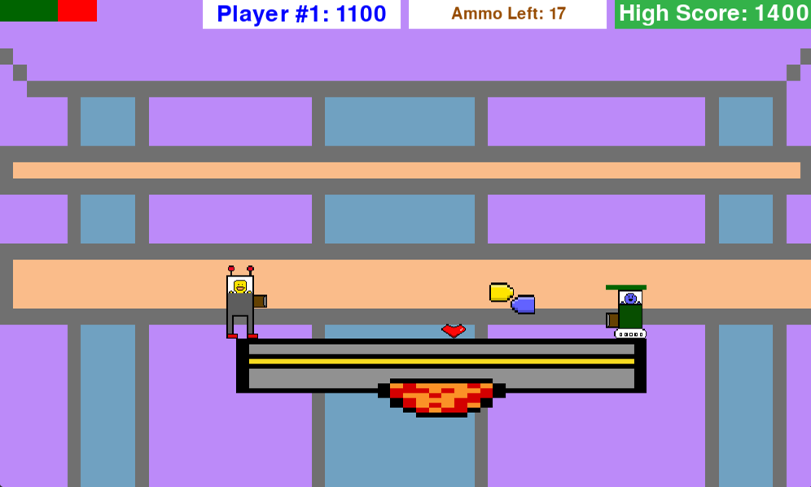

Finished Development: 03/10/2023

Full documentation can be found here: https://micah-ribbens.github.io/Senior-Project

# Summary
This was the project that I worked on my senior year of high school. It solely used a game engine that I wrote 
(rendering was taken care of by libraries). It has four games and they can either be played with a controller or keyboard. I worked with somebody else to put the games in a wooden arcade cabinet that we built.

## Robowars: an endless platformer where the player is chased by a monster. There are powerups, enemies, and the player can jump in midair.

## Space Shooter: a space shooter that has some similarities to Galaga

## No Internet Game: game that is similar to Google's No Internet Dinosaur Game. I added a twist though (horizontal movement)!

## Bird Shooter: pong-like game where you have to shoot the ball multiple times to have it change direction

# How To Run
This project has multiple dependencies that need to be downloaded: pygame and game-qu. So type these commands in the terminal
before running. The file that needs to be run is the game_runner.py file. Make sure you run it from the root directory!
- pip install game-qu
- pip install pygame

# Playing the games:
## Navigating the different games
- If you click any button on the main screen, you will be taken to that game
- Hit the escape key to go back to the main screen
- Hit the 'h' key to go to Robowars
- Hit the 'j' key to go to Space Shooter
- Hit the 'k' key to go to No Internet Game
- Hit the 'l' key to go to Bird Shooter

## Robowars
- To move left and right use the 'a' and 'd' keys
- To jump press the 'w' key
- To shoot press the 'f' key

## Space Shooter
### Player One
- Move left and right with the 'a' and 'd' keys
- Shoot with the 'w' key. The longer the key is held in the bigger the laser is (small, medium, or large)
- Spawn new meteorites with the 's' key

### Player Two
- Move left and right with the left and right arrow keys
- Shoot with the up arrow key. The longer the key is held in the bigger the laser is (small, medium, or large)
- Spawn new meteorites with the down arrow key

### Navigating the game modes
- If you click any button the main game screen, you will be taken to that game mode
- Hit the 'q' key to go back to the main game screen

## No Internet Game
- To move left and right use the 'a' and 'd' keys
- To jump press the 'w' key

## Bird Shooter
### Player One
- Move left and right with the 'a' and 'd' keys
- Move up and down with the 'w' and 's' keys
- Shoot with the 'f' key. The longer the key is held in the bigger the laser is (small, medium, or large)
- Hold the 'g' key to enter a mode where you can move the beak up and down using the 'a' and 'd' keys

### Player Two
- Move left and right with the left and right arrow keys
- Move up and down with the up and down arrow keys
- Shoot with the question mark key. The longer the key is held in the bigger the laser is (small, medium, or large)
- Hold the period key to enter a mode where you can move the beak up and down using the left and right arrow keys
